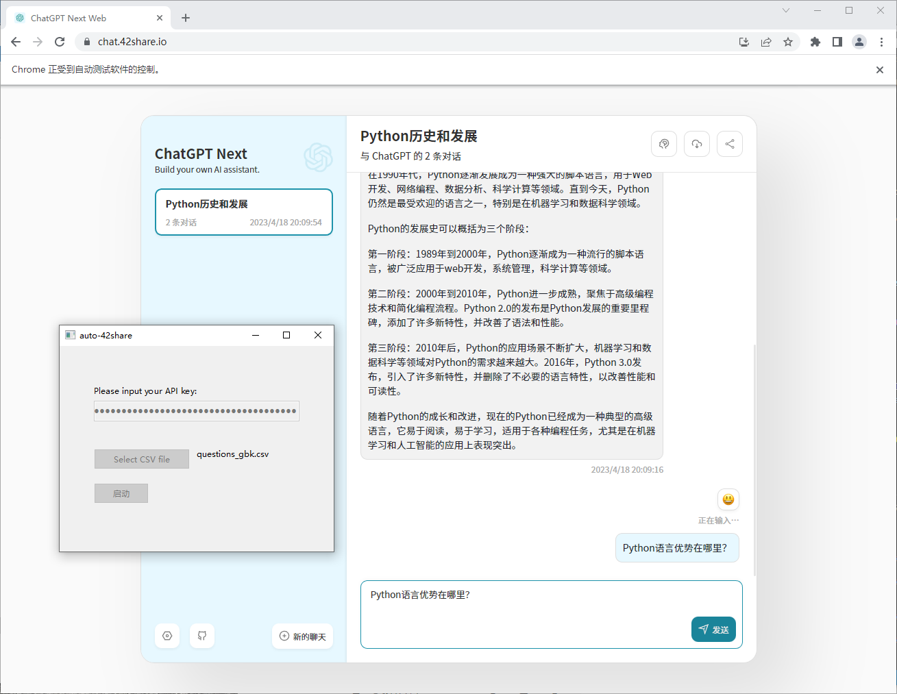

# auto-42share

## 开发环境

- Win10
- python310

## 使用说明

1、首先需要谷歌浏览器找到版本，在浏览器右上角，点击「设置」，左边菜单点击「关于Chrome」；
2、然后到 http://chromedriver.storage.googleapis.com/index.html 下载对应的工具，放到chromedriver文件夹，如果版本不对，会启动不成功；
2、启动程序，填入你的chatgpt apikey，选择csv数据文件。csv文件中，每行必须5个问题以上，一行是一组，参见question.csv；
3、等程序运行完后，可以在当前目录找到一个excel文件，里面是今天对话标题和链接，注意运行程序的时候不要打开excel，否则会写不进数据；
4、最后拷贝标题和链接就行了。
